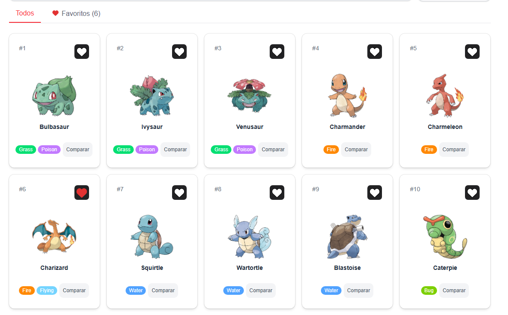
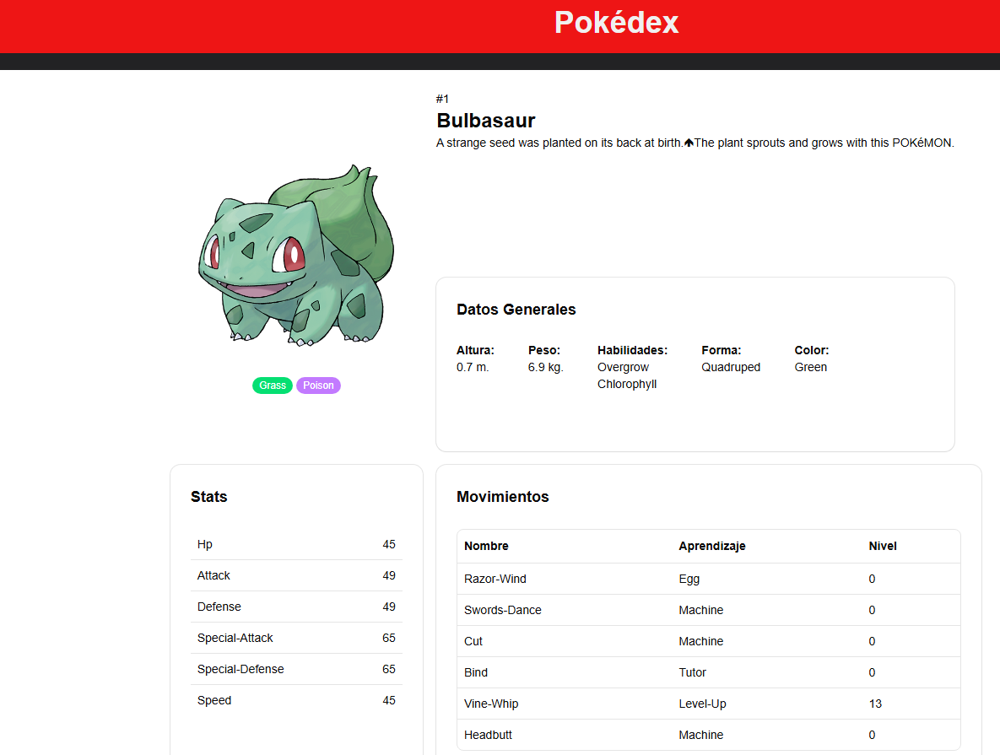
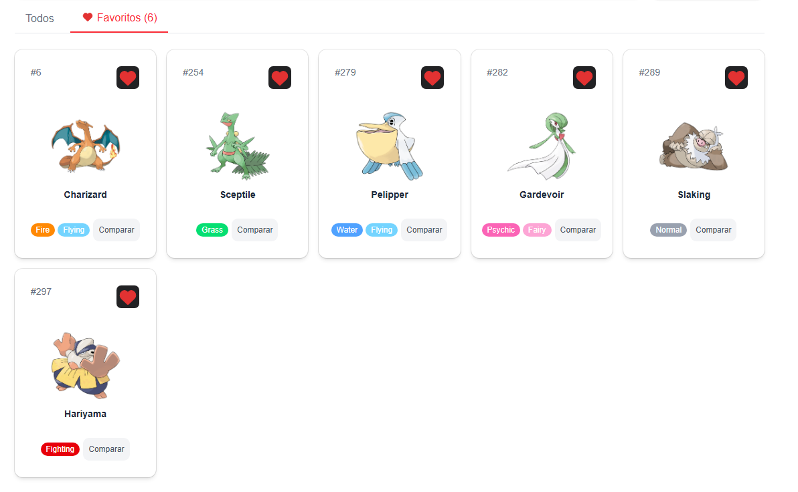
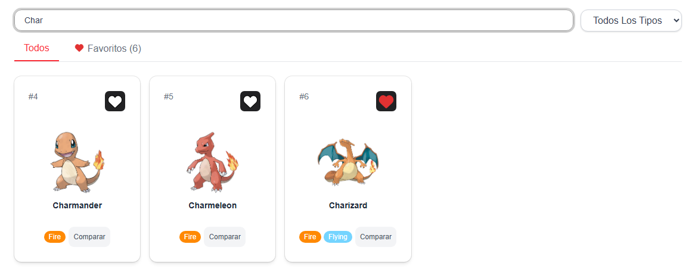
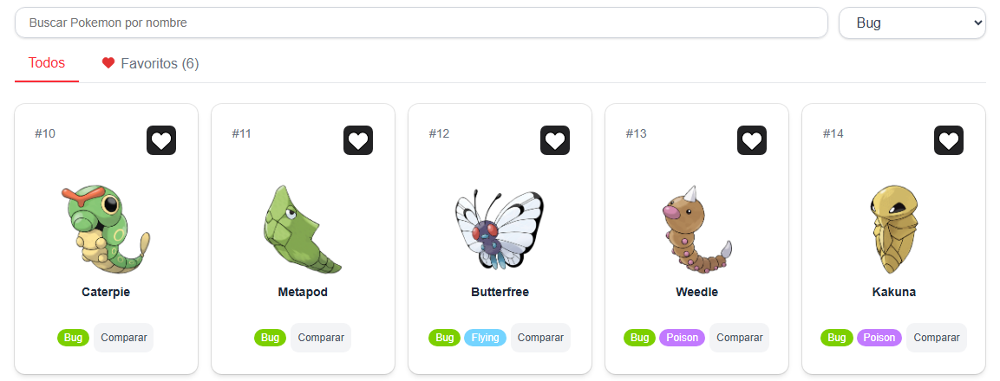
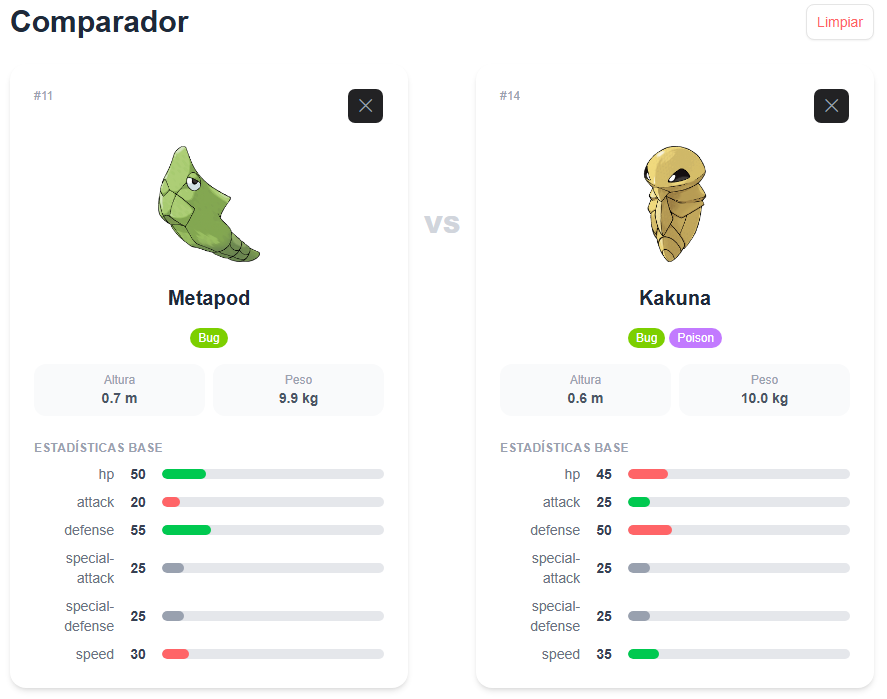

# Pokédex App

**Desarrollador:** Diego Manzo Escalante  
**Materia:** Desarrollo de Aplicaciones Web  
**Universidad:** Universidad Autónoma de Baja California — FIAD

---

## Descripción

Aplicación web tipo Pokédex construida con React, TypeScript y Vite que consume
PokéAPI para listar pokemones, consultar sus detalles, buscar, filtrar por tipo, 
guardar favoritos y comparar estadísticas base entre dos pokemones.

---

## Tecnologías utilizadas

- React + Vite + TypeScript
- Tailwind CSS
- React Router DOM
- Axios
- Zustand

---

## Instalación y ejecución

```bash
# 1. Clonar el repositorio
git clone

# 2. Mover a carpeta donde se clono el repositorio
cd PokeAPI_AW

# 3. Instalar dependencias
pnpm install

# 4. Ejecutar en desarrollo
pnpm run dev
```

Abrir `http://localhost:5173` en el navegador.

---

## Funcionalidades implementadas

- Listado de Pokémon con nombre, imagen, número y tipos
- Detalle de Pokémon con stats, habilidades, altura y peso
- Búsqueda por nombre
- Filtro por tipo usando el endpoint `/type/{name}` (RF04)
- Favoritos con persistencia en localStorage con Zustand
- Comparador de estadísticas base entre dos pokemones
- Estados de carga, error y sin resultados

## Capturas de pantalla

| Listado |
|---------|
|  |

| Detalles |
|---------|
|  |

| Favoritos |
|---------|
|  |

| Busqueda |
|---------|
|  |

| Filtrado |
|---------|
|  |

| Comparador |
|---------|
|  |